# NGSAbDiscov

NGSAbDiscov converts paired-end antibody-display sequencing data into ranked,
traceable candidate sets for each target. It follows Fab, VHH, or mixed
libraries across selection rounds, identifies CDR sequences, quantifies clones,
and compares their abundance across targets and selection conditions.

A useful lead is more than the most abundant read. NGSAbDiscov brings together
experimental selection evidence, repertoire context, campaign history, and
optional Delphi PSR and SEC scores. The final workbooks retain the underlying
frequencies, sequences, flags, and model scores so each candidate can be
reviewed before ordering.

## Main workflow

Library selections and any controls are sequenced together. The sample sheet
keeps every sample linked to its target, block, round, arm, condition, and
library type. NGSAbDiscov uses those fields to compare like with like and to
keep different libraries or experimental blocks separate during aggregation.

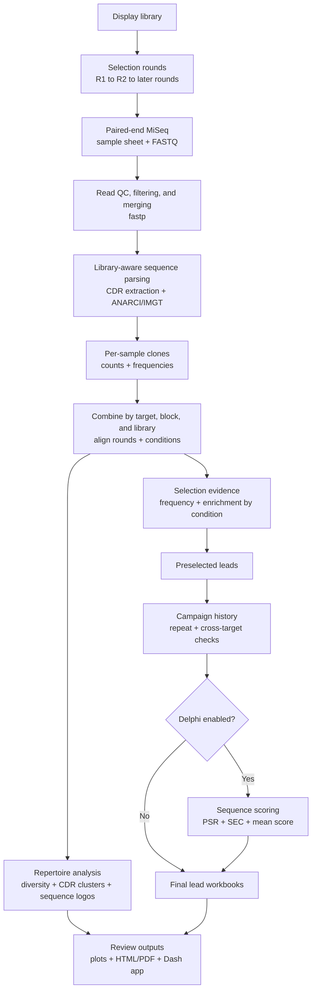

The workflow keeps distinct questions visible in the final review:

| Evidence | What it tells the reviewer |
| --- | --- |
| Frequency and enrichment | Which clones expand across rounds or under stronger selection conditions. |
| Shannon, inverse Simpson, and rarefaction | Whether the repertoire is narrowing and whether sequencing depth supports richness comparisons. These are campaign QC measures, not lead scores. |
| CDR sequence and clustering | Which candidates belong to related sequence families and which representatives preserve sequence diversity. |
| Repeat and cross-target checks | Whether a clone has appeared in earlier campaigns or occurs across several targets. |
| Delphi PSR and SEC scores | Optional sequence-based developability evidence for comparing candidates that already have selection support. |

The main outputs are:

- `sample_qc_table.csv`, with read-processing and repertoire QC for every sample
- `*_clones.csv`, with per-sample clone counts and frequencies
- `by_protein/*_final_leads.xlsx`, with ranked leads for each target
- `data_summary.csv` and `ml_summary.csv`, with campaign-level summaries
- `plots/*.png`, plus `report.html` and optionally `report.pdf`
- `run_manifest.json`, which records the completed run

## Example campaign: MiSeq 117

The following results come from a VHH selection campaign processed with
NGSAbDiscov. The run contained 39 samples, 11 targets, and selection rounds 3
through 7.

| QC measure | MiSeq 117 result |
| --- | ---: |
| Samples | 39 |
| Targets | 11 |
| Raw reads | 7,535,814 |
| Merged reads | 6,963,775 |
| Median merge rate | 92.81% |
| Reads assigned a CDR3 | 6,895,227 (99.02% of merged reads) |
| Median antibody-annotation rate | 96.40% |
| Median cross-target read rate | 1.68% |
| Cross-target read range | 0.31% to 37.53% |

Raw read depth ranged from 90,764 to 399,076 reads per sample, and the median
merge rate was 92.81%. The sample-level plot makes lower-yield and lower-merge
libraries easy to identify before lead ranking.

<p align="center">
  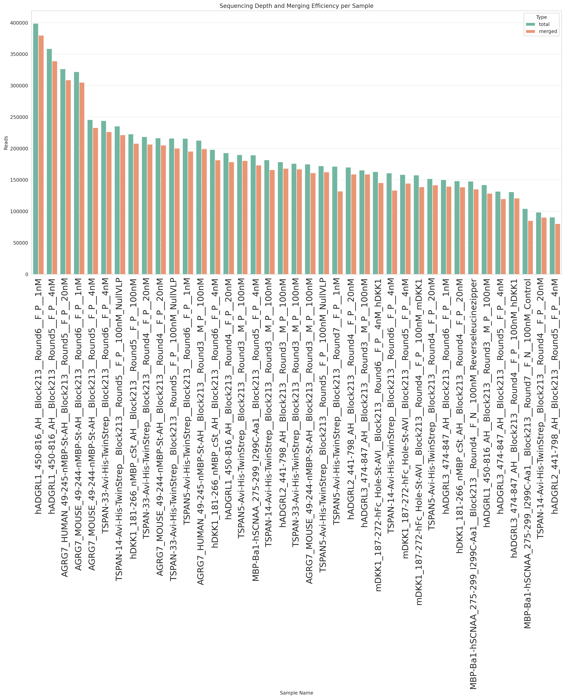
</p>

### Repertoire diversity

The target-level view summarizes the sample distribution for each target while
the colored points retain the selection-round identity of individual samples.

<p align="center">
  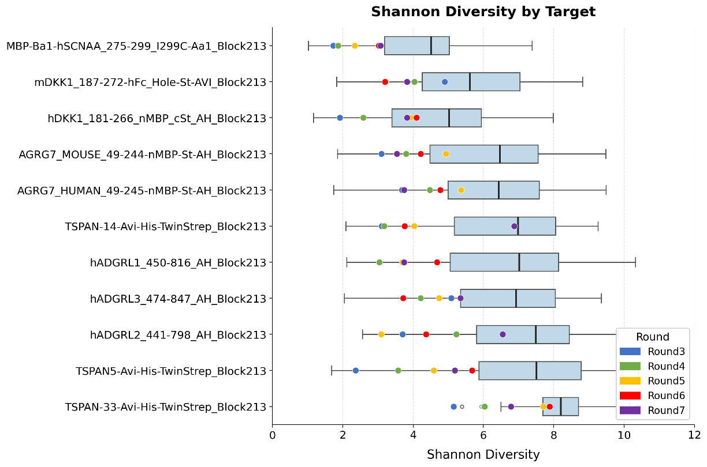
</p>

The median Shannon diversity decreased from 10.39 in round 3 to 7.70 in round
4, 4.99 in round 5, and 3.46 in round 6. The inverse Simpson analysis shows the
same decline in dominant-clone diversity on a `log10(1 + value)` scale. Together,
the metrics are consistent with progressive repertoire narrowing during
selection. Round 7 contained only two samples, so its distributions should not
be compared with the earlier rounds without that sample-count difference in
mind.

<p align="center">
  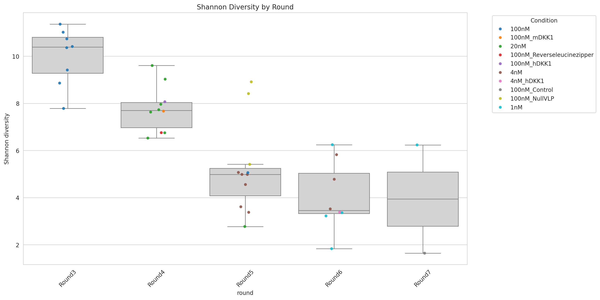
</p>

<p align="center">
  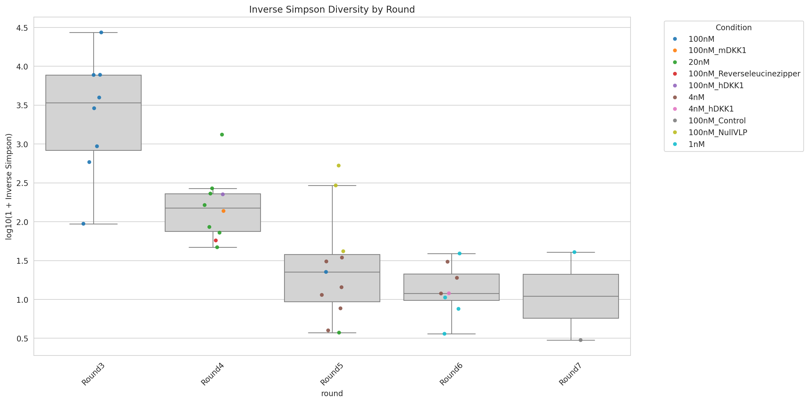
</p>

### Rarefaction at 100 nM

The rarefaction curves compare CDR3 richness at matched subsampled read depths.
Several curves continue to rise at their maximum depth, so richness comparisons
should account for sequencing depth instead of relying only on the final unique
CDR3 count.

<p align="center">
  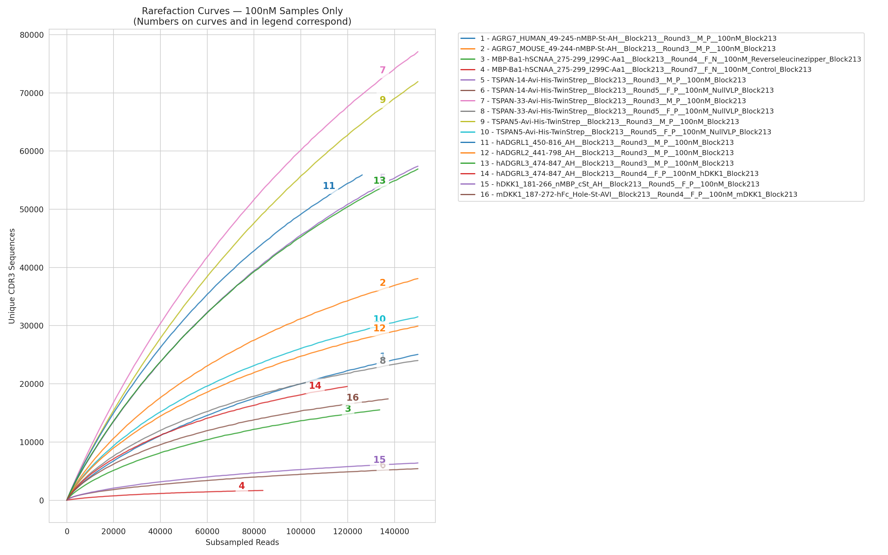
</p>

### Representative CDR sequence logos

Weighted sequence logos summarize the final HSEQ assignments for the AGRG7
human target after ANARCI/IMGT alignment and the report's annotation and
frequency filters. Letter height shows the amino-acid information at each IMGT
position. The CDR1, CDR2, and CDR3 logos include 37, 263, and 231 unique
sequences, respectively.

<p align="center">
  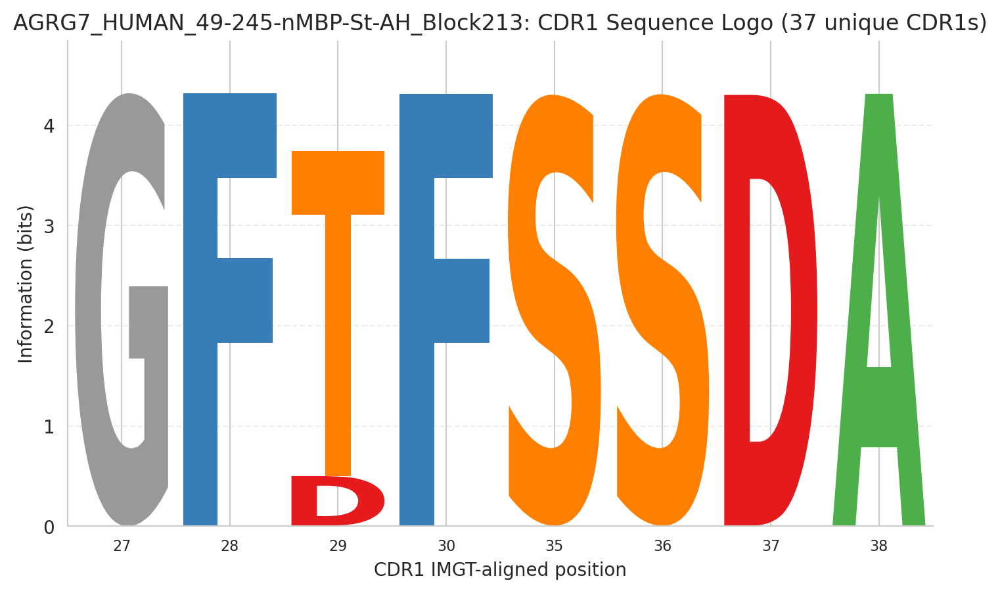
</p>

<p align="center">
  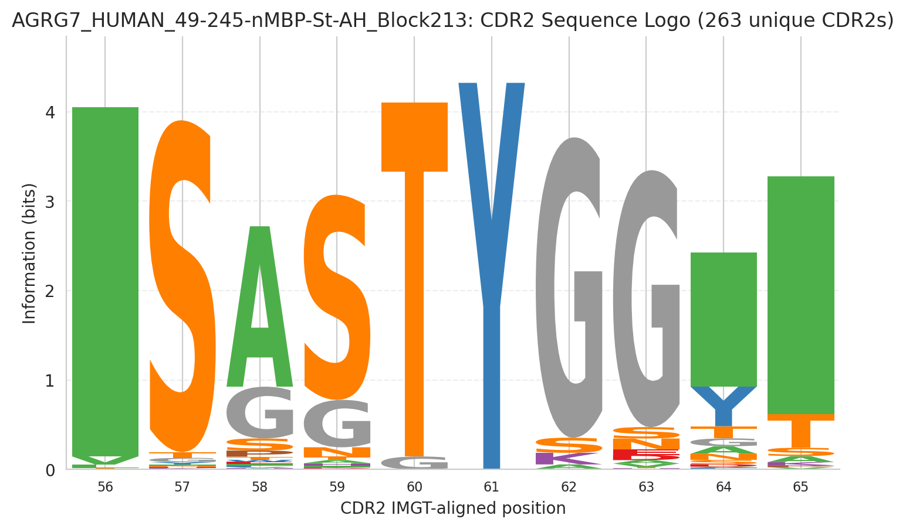
</p>

<p align="center">
  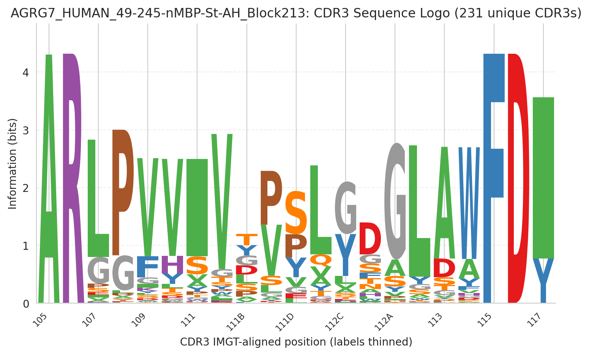
</p>

### Delphi PSR and SEC profiles

The target-level PSR plot shows the distribution of sequence scores for each
target. The dashed line marks the report's 0.5 display threshold; selection
frequency and enrichment remain separate evidence in the lead review.

<p align="center">
  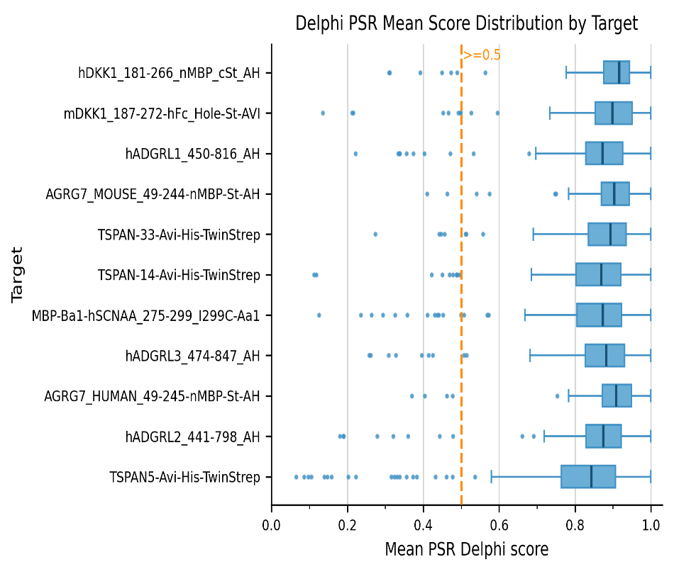
</p>

The Delphi profiles compare sequence features above and below the 0.5 score
threshold. Each panel shows one HCDR3 or heavy-chain property, including amino
acid counts, loop length, net charge, and isoelectric point. These distributions
describe the sequences grouped by the model scores; they do not establish that
any individual feature caused a PSR or SEC prediction.

<p align="center">
  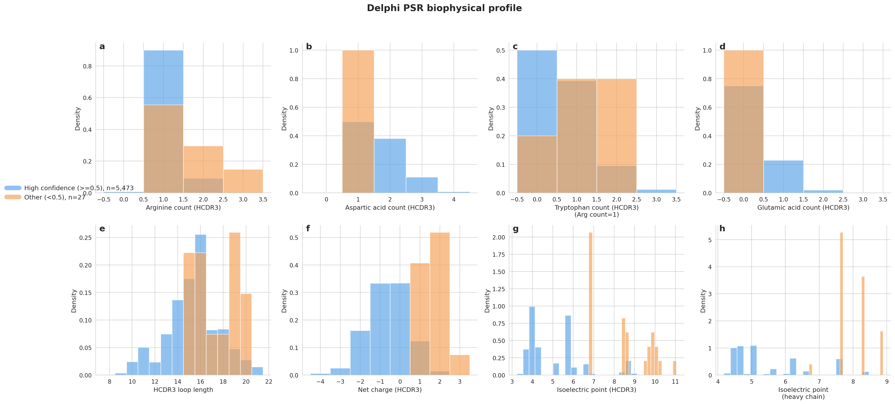
</p>

<p align="center">
  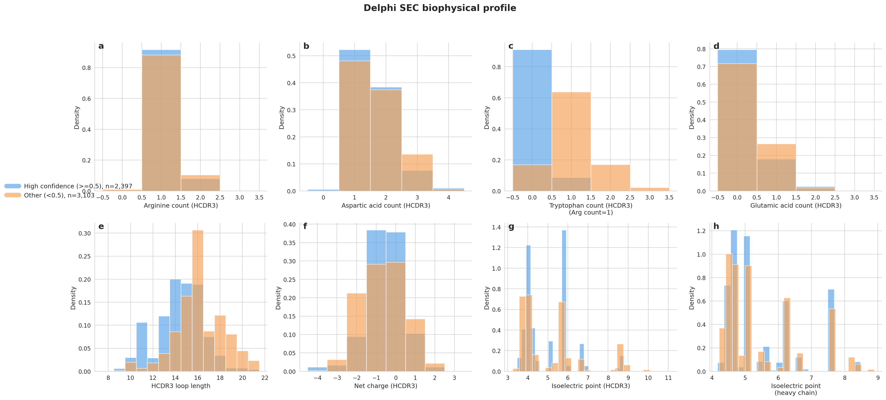
</p>

### Lead enrichment

Target-level fold-change plots connect enrichment with clone rank. In the
example below, each point is a clone, the x-axis is the log2 frequency ratio
between the 4 nM and 20 nM selections, and the y-axis is log rank. Green points
have a mean Delphi score above 0.5. Dashed lines mark the report thresholds used
to review candidate leads.

<p align="center">
  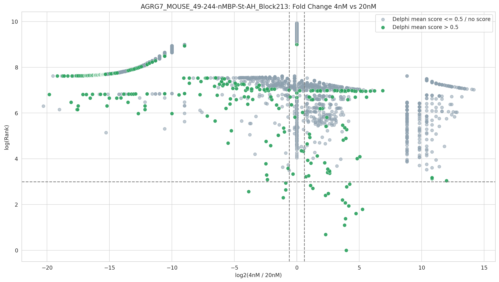
</p>

The cross-target QC distribution was wide. Most samples were near the low end,
but the maximum reached 37.53%, identifying a sample that warrants review
before ordering leads.

## Features

- Paired-end FASTQ quality control, filtering, and merging
- Fab and VHH library definitions with configurable barcode regions
- Mixed-run validation with one library type per target and block
- CDR extraction, ANARCI annotation, clone counting, and frequency calculation
- Target-level aggregation across rounds and selection conditions
- Lead ranking with frequency, enrichment, liability, and repeat checks
- Cross-target clone detection and sample-level contamination summaries
- Shannon, evenness, inverse Simpson, rarefaction, sequence-logo, and
  fold-change plots
- Optional Delphi-based sequence scoring when the model environment is
  available
- HTML and PDF campaign reports plus an interactive Dash review app

## Installation

Clone the repository and create a dedicated Python environment:

```bash
git clone https://github.com/proteininnovation/NGSAbDiscov.git
cd NGSAbDiscov
python -m venv .venv
source .venv/bin/activate
pip install -r requirements.txt
```

Install the command-line tools used by the processing step and set their paths
in `config.yaml`:

```bash
conda install -c bioconda fastp mafft hmmer=3.3.2
```

ANARCI must also be available in the same environment. See the
[ANARCI repository](https://github.com/oxpig/ANARCI) for installation options.

## Input files

Each run needs paired FASTQ files and a sample sheet. New sample sheets require
these columns:

| Column | Description |
| --- | --- |
| `TubeBarcode` | FASTQ tube or index identifier. FASTQ filenames should start with this value. |
| `Sample_Name` | Sample identifier in `target__block__round__arm__condition` format. |
| `library` | Library alias or configured library name, such as `fab`, `vhh`, `standard_fab`, or `vhh_full`. |

Legacy `Sample_ID` and `Description` columns are accepted with a conversion
warning. A sequencing run may contain both Fab and VHH samples, but every
`target + block` group must use one library type.

## Configuration

Start from `config.yaml` or `config_VHH.yaml` and update at least:

- `general.base_dir`
- `general.fastp_path`
- `general.mafft_path`
- `general.previous_antibodies_db`
- `general.output_folder`
- the barcode definitions for the libraries used in the run

Processing, aggregation, lead-selection, repeat-check, reporting, and optional
ML settings live in the same YAML file. Relative paths are resolved from
`general.base_dir`.

## Run the pipeline

Validate the sample sheet and FASTQ pairing before starting a full run:

```bash
python __main__.py validate-sample-sheet \
  --config config.yaml \
  --sample-sheet /path/to/SampleSheet.xlsx \
  --fastq-folder /path/to/Fastq \
  --lib mixed
```

Run all processing, aggregation, lead selection, optional ML scoring, and
report generation in one command:

```bash
python __main__.py run-all \
  --config config.yaml \
  --sample-sheet /path/to/SampleSheet.xlsx \
  --fastq-folder /path/to/Fastq \
  --output-folder results \
  --lib mixed \
  --report-format both
```

Use `--skip-ml` when the optional model environment is unavailable. Use
`--lib fab` or `--lib vhh` to force one library type for the run.

The stages can also be run separately:

```bash
python __main__.py process --config config.yaml --sample-sheet SampleSheet.xlsx --fastq-folder Fastq
python __main__.py combine --config config.yaml --folder results
python __main__.py pick-leads --config config.yaml --folder results
python __main__.py check-repeats --config config.yaml --folder results
python __main__.py ml-prediction --config config.yaml --folder results
python __main__.py generate-plots --folder results --report-format both
```

## Interactive clone review

Launch the Dash application after generating the target-level lead workbooks:

```bash
python __main__.py clone-app --results-folder /path/to/results
```

The app reads `by_protein/*_final_leads.xlsx` and provides filters, plots, and
tables for reviewing candidate clones.

## Notes on the example

The MiSeq 117 figures include report exports and target-level summary plots from
the same campaign. Summary values were calculated from its
`sample_qc_table.csv`. Counts describe this run only and are included to show
the scale and diagnostic output of a completed campaign.
